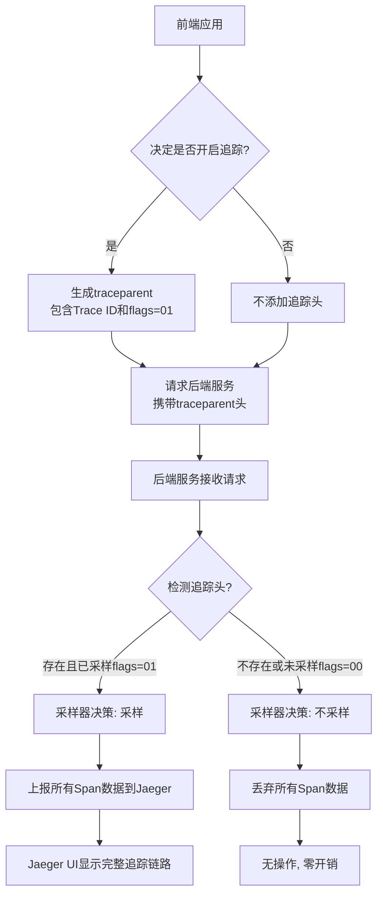

import { Tab, Tabs } from '@rspress/core/theme';

# Trace

OpenTelemetry 也被称为 OTEL，是一个供应商中立的、开源的可观测性框架， 可用于插桩、生成、采集和导出链路、 指标和日志等遥测数据。
OpenTelemetry 作为一个行业标准，得到了 40 多个可观测供应商的支持， 被许多代码库、服务和应用集成，被众多最终用户采用。

因此我们Trace标准采用 [opentelemetry](https://opentelemetry.io/docs/)

##  默认配置

<Tabs>
  <Tab label="toml">
```toml 
[trace]
  enable = false
  # 默认stdout, 用于开发调试, 生产推荐otlp 模式
  provider = "otlp"
  endpoint = "127.0.0.1:4317"
  insecure = true
```
</Tab>
<Tab label="env">
</Tab>
```sh 
TRACE_ENABLE=false
TRACE_PROVIDER="otlp"
OTEL_EXPORTER_OTLP_TRACES_ENDPOINT="127.0.0.1:4317"
TRACE_INSECURE = true
```
</Tabs>

## 样例演示


### 环境准备

这里我们使用jaeger作为Trace Provider, 需要提前安装Jager
```sh
docker run --rm --name jaeger \
  -p 16686:16686 \
  -p 4317:4317 \
  -p 4318:4318 \
  -p 5778:5778 \
  -p 9411:9411 \
  -e OTEL_EXPORTER_OTLP_INSECURE=true \        # 明确禁用 TLS
  -e OTEL_EXPORTER_OTLP_TRACES_INSECURE=true \ # 明确禁用 Traces 的 TLS
  cr.jaegertracing.io/jaegertracing/jaeger:2.10.0
```

安装完成后，访问 http://127.0.0.1:16686/ 访问 Jaeger 页面

+ otlp go sdk 使用方法: https://opentelemetry.io/docs/languages/go/exporters/
+ jaeger 端口说明: https://www.jaegertracing.io/docs/1.55/getting-started/#all-in-one


### 接口

社区提供了很多开箱即用的组件库: [Registry](https://opentelemetry.io/ecosystem/registry/)

1. http server
+ gin 
+ gorestful

2. rpc 
+ grpc
+ jsonrpc(http server)

### 数据库与中间件

+ mysql
+ mongodb
+ redis

### 客户端

1. restful client
[resty](https://github.com/dubonzi/otelresty)

2. http client 
[otelhttp](https://github.com/open-telemetry/opentelemetry-go-contrib/tree/main/instrumentation/net/http/otelhttp/example)

### 自定义埋点

```go
tracer := otel.Tracer("helloworld-api")
_, span := tracer.Start(c.Request.Context(), "getUser", trace.WithAttributes(attribute.String("id", "user01")))
defer span.End()
```

### 测试

```sh
curl -H "traceparent: 00-30e3f16352ca27246d8866f519dfcc93-0000000000000001-01" http://localhost:8020/api/exapmle/v1/api.helloserviceapihandler/
```

## 采样策略

该流程图展示了前端驱动的分布式追踪决策流程：



TraceIDRatioBased(ratio float64) 确实是一个百分比采样器：参数范围：0.0 到 1.0 之间的浮点数

+ 0.0：不采样任何 trace（0%）
+ 0.5：采样 50% 的请求
+ 1.0：采样所有请求（100%）

工作原理：基于 TraceID 进行哈希计算，确保相同的 TraceID 在不同服务中会有相同的采样决策

推荐的采样策略:
```sh
前端/网关 (采样率: 10%)
    ↓
你的Go服务 (ParentBased + 根采样率: 0%)
    ↓
结果: 只有那10%被网关采样的请求会在你的服务中产生trace
```

<Tabs>
  <Tab label="javascript">
```js 
function generateTraceparent() {
    const version = '00';
    // 生成32字符的随机十六进制作为Trace ID
    const traceId = Array.from({length: 32}, () => 
        Math.floor(Math.random() * 16).toString(16)
    ).join('');
    const spanId = '0000000000000001'; // 根跨度Span ID
    const flags = '01'; // 01=已采样，00=未采样
    
    return `${version}-${traceId}-${spanId}-${flags}`;
}
```
</Tab>
<Tab label="golang">
```go
func TestGenerateTraceparentLikeJS(t *testing.T) {
	// 仿照JavaScript版本实现
	traceparent := generateTraceparent()
	t.Logf("Generated traceparent: %s", traceparent)
}

func generateTraceparent() string {
	const version = "00"

	// 生成32字符的随机十六进制作为Trace ID
	traceId := generateValidRandomHex(32)

	// 生成16字符的随机十六进制作为Span ID
	spanId := generateValidRandomHex(16)

	// 01=已采样，00=未采样
	flags := "01"

	return fmt.Sprintf("%s-%s-%s-%s", version, traceId, spanId, flags)
}

// generateValidRandomHex 生成指定长度的随机十六进制字符串，确保不全为0
func generateValidRandomHex(length int) string {
	const hexChars = "0123456789abcdef"
	result := make([]byte, length)
	r := rand.New(rand.NewSource(time.Now().UnixNano()))

	// 生成随机十六进制字符串
	for i := range result {
		result[i] = hexChars[r.Intn(len(hexChars))]
	}

	// 确保不全为0（至少有一个非0字符）
	allZeros := true
	for _, b := range result {
		if b != '0' {
			allZeros = false
			break
		}
	}

	// 如果全为0，则将第一个字符设为1
	if allZeros {
		result[0] = '1'
	}

	return string(result)
}
```
</Tab>
</Tabs>


## 生产环境注意事项

+ 监控导出器状态：添加健康检查监控导出器是否正常工作
+ 错误处理：妥善处理导出失败的情况，避免影响主业务
+ 性能调优：根据实际流量调整批量处理参数
+ 安全配置：生产环境使用 TLS 和认证
+ 避免 stdout：生产环境不要使用 stdout exporter

## 原生使用

```go
package main

import (
    "context"
    "log"
    "net/http"
    "time"

    "go.opentelemetry.io/otel"
    "go.opentelemetry.io/otel/exporters/otlp/otlptrace/otlptracegrpc"
    "go.opentelemetry.io/otel/propagation"
    "go.opentelemetry.io/otel/sdk/resource"
    sdktrace "go.opentelemetry.io/otel/sdk/trace"
    semconv "go.opentelemetry.io/otel/semconv/v1.21.0"
    "google.golang.org/grpc"
    "google.golang.org/grpc/credentials/insecure"
)

func main() {
    ctx := context.Background()

    // 1. 初始化导出器 (连接到本地Collector)
    traceExporter, err := otlptracegrpc.New(ctx,
        otlptracegrpc.WithEndpoint("localhost:4317"), // OTLP gRPC 收集器端点
        otlptracegrpc.WithInsecure(),                 // 开发环境使用非安全连接
        // otlptracegrpc.WithDialOption(grpc.WithBlock()), // 可选：阻塞连接
    )
    if err != nil {
        log.Fatalf("failed to create trace exporter: %v", err)
    }

    // 2. 配置资源
    res, err := resource.New(ctx,
        resource.WithAttributes(
            semconv.ServiceNameKey.String("my-awesome-go-service"),
            semconv.ServiceVersionKey.String("1.0.0"),
        ),
        resource.WithProcess(),
        resource.WithHost(),
    )
    if err != nil {
        log.Fatalf("failed to create resource: %v", err)
    }

    // 3. 创建 BatchSpanProcessor 和 TracerProvider
    bsp := sdktrace.NewBatchSpanProcessor(traceExporter)
    tp := sdktrace.NewTracerProvider(
        sdktrace.WithSampler(sdktrace.AlwaysSample()),
        sdktrace.WithResource(res),
        sdktrace.WithSpanProcessor(bsp),
    )
    defer func() {
        // 7. 优雅关闭
        ctx, cancel := context.WithTimeout(ctx, 5*time.Second)
        defer cancel()
        if err := tp.Shutdown(ctx); err != nil {
            log.Fatalf("failed to shutdown TracerProvider: %v", err)
        }
    }()

    // 4. 设置全局 TracerProvider 和 Propagator
    otel.SetTracerProvider(tp)
    otel.SetTextMapPropagator(propagation.TraceContext{})

    // 5. 使用自动 Instrumentation 包装 HTTP 处理器
    http.HandleFunc("/hello", func(w http.ResponseWriter, r *http.Request) {
        // 手动创建一个Span来记录一些操作
        tracer := otel.Tracer("example-tracer")
        ctx, span := tracer.Start(r.Context(), "my-handler-logic")
        defer span.End()

        // 模拟一些工作
        time.Sleep(100 * time.Millisecond)
        span.AddEvent("Did some work!")

        w.Write([]byte("Hello, World!"))
    })

    // 使用 otelhttp 中间件包装整个路由（可选，但推荐用于自动处理HTTP请求的Span）
    wrappedHandler := otelhttp.NewHandler(http.DefaultServeMux, "server")

    log.Println("Starting server on :8080")
    if err := http.ListenAndServe(":8080", wrappedHandler); err != nil {
        log.Fatalf("failed to start server: %v", err)
    }
}
```